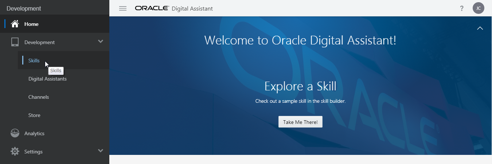

# Oracle Digital Assistant - はじめてのスキル開発

## はじめに

Oracle Digital Assistant is an environment for building digital assistants, which are user interfaces driven by artifical intelligence (AI) that help users accomplish a variety of tasks in natural language conversations.
Digital assistants consist of one or more skills, which are individual chatbots that are focused on specific types of tasks.

In this lab, you will create a skill that can be used for interactions with a pizzeria, including ordering pizzas and canceling orders.
As part of this process, you will:

* Define intents, utterances, entities.
* Design a conversation flow.
* Validate, debuga and test your skill.

### 事前準備

* Access to Oracle Digital Assistant.

### このチュートリアルの表記方法

このチュートリアルで使用している表記方法は次のとおりです。

| 表記方法 | 説明 |
|--------|-----|
| **「太字」** | ボタン、各種フィールドのラベルなどの GUI 要素 |
| _<イタリック>_ | 使用する環境などによって置き換える部分を表すプレースホルダー |
| `固定幅フォント` | 実行するコマンド、URL、サンプルコード、入力するテキスト |

## スキルの作成

In this lab, we're starting from scratch.
So the first thing you'll do is create a new skill.

**【ステップ 1】**
Oracle Digital Assistant の Designer UI を Web ブラウザで開きます。
画面左上の ![ハンバーガー・アイコン][icon_hamburger] をクリックしてメニューを開きます。

<!--  -->

**【ステップ 2】**
メニューから **「Develpment」** をクリックし、 **「Skills」** を選択します。

<!--  -->

**【ステップ 3】**
メニューを閉じるために、 ![ハンバーガー・アイコン][icon_hamburger] をもう一度クリックします。

**【ステップ 4】**
**「New Skill」** をクリックします。


**「Create Skill」** ボックスが表示されます。


**【ステップ 5】**
**「Create Skill」** ダイアログの **「Display Name」** フィールドに `Pizza King` と入力します。
このチュートリアルを同じ環境で実施する人が他にもいる場合は、区別できるように `Pizza King` の前または後ろにあなたのイニシャルなどを付けてください。

**【ステップ 6】**
**「Version」** フィールドに `1.0` と入力します。

**【ステップ 7】**
**「Create」** ボタンをクリックします。

The designer will then open on the **「Intents」** page.
Here's where we'll begin to express the use case (that is, the PizzaKing-customer activity flow) in terms of the concepts that support Natural Language Processing (NLP): intents and entities.

## インテントの作成

Oracle Digital Assistant's underlying natural language processing (NLP) engine doesn't inherently know about the business or task that a skill is supposed to assist with.
For the skill to understand what it should react to, you need to define intents and examples (utterances) for how a user would request a specific intent.

For the PizzaKing example, you will create intents for ordering pizza, cancelling an order, and filing a complaint.

### インテントの作成 (1) OrderPizza

**【ステップ 1】**
Designer UI の画面左側のナビゲーションで ![「Intents」アイコン][icon_intents_selected] が選択されていることを確認します。

**【ステップ 2】**
![「+ Intent」ボタン][button_create_intent] をクリックします。

**【ステップ 3】**
**「Name」** フィールドに `OrderPizza` と入力します。

**【ステップ 4】**
Copy the example sentences below, paste them into the Enter your example utterances here field, and press the Enter key.
(Yes, you can paste all of them at once.)

* Would you happen to have thin crust options on your Pizzas?
* Let's order a cheese pizza
* Would love a large Pepperoni please!
* I feel like eating some pizza
* I would like to order a pizza
* Can I order a Pizza?
* What's on the menu today?
* I want pizza
* Do you server gluten-free pizza?
* I want to order pizza for lunch
* Do you have deep dish pizzas available?
* Order Pizza!

### インテントの作成 (2) CancelPizza

**【ステップ 1】**
![「+ Intent」ボタン][button_create_intent] をクリックします。

**【ステップ 2】**
**「Name」** フィールドに `CancelPizza` と入力します。

**【ステップ 3】**
Copy the example sentences below, paste them into the Enter your example utterances here field, [Enter] キーを押します。

* Can i cancel my order?
* Cancel my order
* Cancel my Pizza please
* How do I cancel my order?
* I don't want my Pizza anymore
* I really don't want the Pizza anymore
* I'd like to cancel my order please
* Its been more than 20 mts. Please cancel my order and issue a refund to my card.
* Need to cancel my order
* Please cancel my pizza order
* Please don't deliver my Pizza

インテント CancelPizza が追加されると、Designer UI には次のように表示されます。


> ***Note:***
> If you are stuck, you can import the intents and utterances using [PizzaKing-Intents.csv].

### インテントのトレーニング

You've now provided the basic ingredients that allow the skill to recognize user input for ordering a pizza, but right now, the skill has no cognition.
It can't understand any user input.

To enable it to understand the intents, you need to train it.

**【ステップ 1】**
画面の右上に ![「Train」ボタン][button_train] が表示されていることを確認します。


**「Train」** ボタンにはエクスクラメーション・マークのアイコンが表示されており、トレーニングが必要なことを表しています。

**【ステップ 2】**
![「Train」ボタン][button_train] をクリックすると **「Train」** ボックスが表示されます。
**「Submit」** ボタンをクリックして数秒待つとトレーニングは完了します。
トレーニングが完了すると **「Train」** ボタンのアイコンがチェック・マークに変わります。

## モデルのテスト

It is not realistic to get the training of your intent model right the first time you do it.
Good intent models are created in an iterative cycle of training, testing, retraining, and retesting.

A good intent model is one that has a low ambiguity between the different intents. So let's see how well we’re doing so far.

**【ステップ 1】**
![「Intents」アイコン][icon_intents_enabled] をクリックします。

**【ステップ 2】**
画面の右上の方にある **「Try It Out!」** リンクをクリックします。

画面の右側に **「Try Out Intents/Q&A」** ボックスが表示されます。

**【ステップ 3】**
**「Try Out Intents/Q&A」** ボックスの一番下にある **「Message」** フィールドに次の文を入力します。

```
I want to order pizza
```

**「Send」** ボタンをクリックすると、**「Try Out Intents/Q&A」** ボックスは次のように表示されます。


`I want to order pizza` は、インテント OrderPizza に該当するという判定をしています。
**「Confidence」** のスコア（今回の場合は「100%」）は、インテント判定エンジンが結果に対する自信を数値化したものです。

**【ステップ 4】**
別の文でテストを行います。
次の文を **「Try Out Intents/Q&A」** ボックスの **「Message」** フィールドに入力したら、**「Send」** ボタンをクリックします。

```
I feel like eating some pizza
```

ステップ 3 で実行したテストと同様に、インテント OrderPizza と判定されます。

**【ステップ 5】**
次の文をテストします。今回は、インテント CancelPizza と判定されます。

```
Cancel my order?
```

**【ステップ 6】**
次の文をテストします。

```
Dude, bring me pizza
```

**「Try Out Intents/Q&A」** ボックスには次のように表示されます。


上の図のとおり、インテント判定エンジンは `Dude, bring me pizza` （日本語訳: 「おい、ピザを持ってきて」）という文はインテント OrderPizza である可能性が最も高いと判定しています。
しかし、**「Confidence」** のスコアはそれほど高くありません。

**【ステップ 7】**
インテント判定エンジンの結果は正しいけれど Confidence のスコアが高くない場合は、テストに使用した文をインテントの例文として追加します。
**「OrderPizza」** を選択した状態で **「Add Example」** ボタンをクリックすると、`Dude, bring me pizza` がインテント OrderPizza に例文として追加されます。

**【ステップ 8】**
インテントの例文を追加したので、トレーニングの実行が必要になりました。
画面右上の ![「Train」ボタン][button_train] をクリックしてトレーニングを実行します。

**【ステップ 9】**
もう一度 `Dude, bring me pizza` という文をテストしてみます。
例文として追加されたので、インテント OrderPizza の Confidence のスコア上がっていることを確認します。

> ***Note:***
> Conversational AI does not compare input by exact matches of the words.
> Though "Dude, bring me pizza" is available as an utterance, when entering the sentence as a message, it is the intent model's algorithm that determines the matching intent.

> ***Note:***
> In these examples, you might get slightly different confidence scores than what are shown here.
> And in some cases, the matching intents themselves could vary, should the differing confidence scores push those intents above or below the given confidence thresholds.
> The cause of this variance is the non-deterministic nature of the AI behind the natural language processing and the fact that these skills have a limited number of training utterances (in order to make the lab simpler).

### このセクションのまとめ

In this part of the tutorial, you have tested the quality of your intent training with the goal being to ensure a high level of confidence when resolving intents.

In a real skill project, you would always need to go back to the intent testing with user-provided entries you find in the conversation logs.
If, using that test input, your intents are not matched the way they should be, you need to add them as example utterances to proper intents and then retrain the model.

> ***Note:***
> Oracle Digital Assistant also has a batch mode that allows you to test based on a log of a previous set of tests.
> This is useful for re-running a set of tests iteratively as you fine-tune your intents.

## エンティティの作成

Now it's time to add entities, which detect information in the user input that can help the intent fulfill a user request.
For the Pizza King business, such information could be the size of pizza, the toppings of pizza, and delivery time.
For example, the user input "I'd like to order a small meaty pizza at 9:00 pm" contains all three of these information types.

We'll create custom entities for size and topping and later use a built-in entity for time.
While we're at it, we'll add some synonyms (including some common misspellings) that optimize the entity's ability to tag words from sloppy user input.

### エンティティの作成 (1) PizzaSize

**【ステップ 1】**
Designer UI の画面左側のナビゲーションで ![「Entities」アイコン][icon_entities_enabled] をクリックします。
エンティティを作成・編集するための画面が表示されます。

**【ステップ 2】**
新しいエンティティを作成するために、![「+ Entitiy」ボタン][button_create_entity] をクリックします。

**【ステップ 3】**
**「Name」** フィールドにはデフォルトの値がセットされていますが、`PizzaSize` に変更します。

**【ステップ 4】**
**「Configuration」** セクションのドロップダウン・リスト **「Type」** から **「Value list」** を選択します。

**【ステップ 5】**
![「+ Value」ボタン][button_create_value] をクリックします。
**「Create Value」** ボックスが表示されます。

**【ステップ 6】**
**「Value」** フィールドに `Small` と入力します。

**【ステップ 7】**
**「Synonyms」** フィールドに `Personal` と入力したら、キーボードの [Tab] キーを押します。
次に `smallest` を入力します。

**【ステップ 8】**
**「Create Value」** ボックスの **「Create」** ボタンをクリックします。

**【ステップ 9】**
ステップ5～8の手順を繰り返して、エンティティ PizzaSize に次の値を追加します。

| Value | Synonyms |
|-------|----------|
| `Medium` | `middle` |
| `Large` | `Big`, `grande`, `biggest` |

### エンティティの作成 (2) PizzaSize

**【ステップ 1】**
新しいエンティティを作成するために、![「+ Entitiy」ボタン][button_create_entity] をクリックします。

**【ステップ 2】**
**「Name」** フィールドの値を `PizzaType` に変更します。

**【ステップ 3】**
**「Configuration」** セクションのドロップダウン・リスト **「Type」** から **「Value list」** を選択します。

**【ステップ 4】**
**「Value」** として、次の4つを追加します。

| Value | Synonyms |
|-------|----------|
| `Meaty` |   |
| `Veggie` |   |
| `Hot and Spicy` |   |
| `American Hot` |   |

エンティティが作成されると、Designer UI には次のように表示されます。


### インテントとエンティティの関連付け

For an entity to be recognized when parsing the user input message, it needs to be associated with an intent.
So let’s associate our entities with the appropriate intents:

1. In the left navigation for the designer, select **「Intents」**.

2. Select the OrderPizza intent.

3. Click [+ Entity] (in the upper right side of the page).

4. Select the PizzaSize entity.

5. Repeat the previous two steps for the PizzaTopping and TIME entities.
  (TIME is a built-in entity that we'll use to help the skill process input for pizza delivery time.)

6. Retrain the model by clicking [! Train].

  The entity list associated with the OrderPizza intent should look like what is shown in the image below (though the order may be different):

  

### エンティティのテスト

The Try It Out feature enables you to test whether the skill identifies entity values in user input.

1. In the left navigation for the designer, select **「Intents」**.

2. Click [Try It Out!].

3. In the **「Message」** field of the dialog, type `I want to order a small hot and spicy pizza at 7:30 pm` and click **「Send」**.

  You should see a table showing entities and the values extracted from the input.

  

  > ***Note:***
  > You may need to scroll up in the dialog to see the entities.

  Since the entities are recognized in the user input, the skill doesn’t have to ask the user for that information later in the flow.

  Now let's try another one.

4. In the **「Message」** field, now type `I want to order the biggest meaty pizza at noon` and click **「Send」**.

  The result should look like what is shown below and thus prove that the PizzaSize entity shows the right value for the biggest synonym.
  Also "noon" is properly interpreted as 12:00 p.m.

  

### このセクションのまとめ

In this part of the tutorial, you have created custom entities for the PizzaKing OrderPizza intent, associated the entities with the intent, and tested the entity recognition in the embedded skill tester.

Similar to the PizzaOrder intent, you would typically need to create and associate entities for the other intents as well.
In the interest of time, this tutorial only focuses on the PizzaOrder intent.

## ダイアログ・フローのデザイン

With the NLP model created, you are ready to build the dialog flow for the skill.
The dialog flow is a conversation blueprint that defines interactions users may have with the skill.
Each interaction is defined as a state. Each state references a component, which renders a skill response, receives user input, sets and resets variables, resolves user intents, or authenticates users.

### ダイアログ・フローのアウトラインのセットアップ

Our first step is to create the basic flow outline, including context variables and states to handle the user's initial input.

Context variables are the skill's temporary memory.
They can be referenced throughout the dialog flow.
We'll add context variables to hold values returned by the intent engine, entity values, and the value for the pizza order message.

1. In the left navigation for the designer, click [Flows] icon to open the dialog flow editor.

2. Delete all content betwenn the `variables` and `states` elements.

3. Delete all content below the `states` element.

  That should leave you the following remaining code:

  

4. Under `variables:`, add these five context variables:

```yaml
      iResult: "nlpresult"
      pizzaSize: "PizzaSize"
      pizzaTopping: "PizzaTopping"
      deliveryTime: "TIME"
      pizzaOrderMsg: "string"
```

> ***Note:***
> Make sure that they are indented two spaces more than the `variables:` (four spaces total).
> If the indentation isn’t exact, metadata validation will fail.

  This is what the flow should now look like:

  

  Now we're ready to add some states.

### インテントを判定するステートの追加

First we'll add the `System.Intent` component.
This component evaluates user input to determine the user intent, extracts all of the entities, and then triggers a subsequent state.

1. Click [+ Components] to open the gallery of component templates.

2. Select **「Language」** as the component type.

  

3. In the dialog, select **「Intent」** and then switch on **「Remove Comments」**.

  

4. Click **「Apply」**.

5. In the newly added state, set the value of the `variable` property to `"iResult"` (including the quotation marks).

  This means that iResult will be the variable to which the NLP engine saves the intent resolution and entity extraction results to.

6. Delete the following properties:

* botName
* botVersion
* sourceVariable
* autoNumberPostbackActions
* footerText

7. Update transition actions so that it looks like the following:

```yaml
    transitions:
      actions:
        OrderPizza: "startOrderPizza"
        CancelPizza: "cancelPizza"
        unresolvedIntent: "startUnresolved"
```

### 各インテントの処理を開始するステートの追加

Next, you need to create the dialog flow states that each possible outcome navigates to.
To save you some time, the states are provided in a text document for you to copy and paste.

1. Open [states.txt].

2. Copy the file's contents and paste them at the bottom of the dialog flow.

  Make sure that the indentation is preserved in the pasted content.

3. Verify the correctness of your edits by clicking the Validate button on the top of the page.

#### ピザの注文

```yaml
  startOrderPizza:
    component: "System.Output"
    properties:
      text: "Hello, Starting your order process"
      keepTurn: false
    transitions:
      return: "done"
```

#### ピザの注文をキャンセル

```yaml
  cancelPizza:
    component: "System.Output"
    properties:
      text: "I am sorry to hear this. Let me take your cancellation request."
    transitions:
      return : "done"
```

#### インテントを判定できなかった場合

```yaml
  startUnresolved:
    component: "System.Output"
    properties:
      text: "I am sorry I could not understand, lets connect you with someone to help."
      keepTurn: false
    transitions:
      return: "done"
```

### ダイアログ・フローのトラブルシューティング

If you don't see a success message, then most likely you misspelled a property name or did not follow the required two-space indenting increments.
In this case, scroll through the dialog flow until you see an [x error] icon icon in the left margin.
Mouse over the icon to display the tooltip with a description of the problem.

In addition, you can click the debug icon ([debug icon]), which appears to the left of the dialog flow editor.
It often provides additional information about the reason.
You close the debug window by clicking the debug icon again.

If you have gotten into a jam and can’t get anything to work, open the [your-first-dialog-flow.txt] and replace the content in your dialog flow with the content from the file.

### インテントの判定のチューニング

Before moving further, let's take a look at some settings that are useful for fine-tuning intent resolution.

* **Confidence Threshold**:
  The skill uses this property to steer the conversation by the confidence level of the resolved intent.
  Set the minimum confidence level required to match an intent.
  When the level falls below this minimum value, the component triggers its unresolvedIntent action.

* **Confidence Win Margin**:
  When a skill can’t determine a specific intent, it displays a list of possible intents and prompts the user to choose one.
  This property helps the skill determine what intents should be in the list.
  Set the maximum level to use for the delta between the respective confidence levels for the top intents.
  The list includes the intents that are greater than or equal to this delta and exceed the value set for the Confidence Threshold.

Let's update these settings:

1. In the left navigation for the skill, click **「Settings」** icon and select the **「Configuration」** tab.

2. Set the **「Confidence Threshold」** property to `0.6` (meaning 60%).

3. Set the **「Confidence Win Margin」** property to `0.1` (meaning 10%).

  

### ダイアログ・フローのテスト

Before doing any further development, let's test the basic flow to make sure it responds correctly to initial user input.

1. Open the skill tester by clicking ([Skill Tester] icon) in the bottom of the skill's left navigation bar.

2. In the **「Message」** field, type `I want to order a pizza` and then press [Enter].

3. Click the **「Intent/Q&A」** tab to view intent resolution.

  You should see an order process message as shown in the image below:

  

4. Click **「Reset」**.

5. In the **「Message」** field, type `I want to cancel my order` and then press [Enter].

  The skill should respond with a message regarding pizza cancelation.
  And, in the Intent Matches panel, you should see that the CancelPizza intent is matched.

6. Click **「Reset」**.

7. In the **「Message」** field, type `Your delivery is too late, either cancel the order or file a complaint right now` and then press [Enter].

  

  As you can see, both CancelPizza and FileComplaint exceeded the confidence threshold of 60%.
  CancelPizza has a higher score than FileComplaint.
  However, since CancelPizza's score exceeds that of FileComplaint by less than the confidence win margin that we set earlier (10%), the skill presents a dialog so that the user can select what she really wants.

8. Finally, try a last random utterance: `Can you get me a radio taxi now?`

  

  As you can see, the confidence threshold level falls below this minimum value of 60% in this case, so the component triggers its unresolvedIntent action.

### ピザの注文を受ける会話の作成

Now that we have verified that the basic intent model is working, the next step is to implement conversation flows for each intent.
In the interest of time, we'll do this just for the PizzaOrder intent.

We'll complete the pizza order process by fetching the pizza size, topping, and delivery time, and then printing an order summary.

1. In the dialog flow, navigate to the `startOrderPizza` state.

2. Change the text property's value to `"OK, lets get that order sorted"`.

3. Change the `keepTurn` value to `true`

4. Delete the line `return: "done"`

5. Replace the deleted line with

  ```yaml
        next: "setPizzaSize"
  ```

#### ピザのサイズの指定

1. Click a screenshot of the Add Component button to open the gallery of component templates.

2. Select the User Interface category.

3. Select the List – set variable template.
  

4. From the Insert After dropdown, select startOrderPizza.

5. Ensure the Remove Comments switch is ON.

6. Click Apply.

7. Change the state name of the newly added component from variableList to setPizzaSize.

8. Edit the state to look like the following:

```yaml
  setPizzaSize:
    component: "System.List"
    properties:
      options: "${pizzaSize.type.enumValues}"
      prompt: "What size of pizza do you want?"
      variable: "pizzaSize"
      nlpResultVariable: "iResult"
    transitions:
      next: "setPizzaTopping"
```

#### ピザのトッピングの指定

Below the setPizzaSize state, paste the following code (also based on the System.List component) to create the setPizzaTopping state:

```yaml
  setPizzaTopping:
    component: "System.List"
    properties:
      options: "${pizzaTopping.type.enumValues}"
      prompt: "What type of pizza would you like?"
      variable: "pizzaTopping"
      nlpResultVariable: "iResult"
    transitions:
      next: "setPizzaDeliveryTime"
```

#### ピザの配達時間の指定

1. Click a screenshot of the Add Component button.

2. Select the User Interface category.

3. Select the Text template.

4. From the Insert After dropdown, select setPizzaTopping.

5. Ensure the Remove Comments switch is ON.

6. Click Apply.

7. Change the state name of the newly added component from text to setPizzaDeliveryTime.

8. Edit the state to look like the following:

```yaml
  setPizzaDeliveryTime:
    component: "System.Text"
    properties:
      prompt: "When can we deliver that for you?"
      variable: "deliveryTime"
      nlpResultVariable: "iResult"
      maxPrompts: 3
    transitions:
      actions:
        cancel: "maxError"
        next: "setPizzaOrderMessage"
```

#### 注文内容の確認メッセージの生成

1. Click [Components] of the Add Component button.

2. Select the Variables category.

3. Select the Set variable template.

4. From the Insert After dropdown, select setPizzaDeliveryTime.

5. Ensure the Remove Comments switch is ON.

6. Click Apply.

7. Change the state name of the newly added component from setVariable to setPizzaOrderMessage.

8. Edit the state to look like the following:

```yaml
  setPizzaOrderMessage:
    component: "System.SetVariable"
    properties:
      variable: "pizzaOrderMsg"
      value:
      - "Thank you for ordering from Pizza King!"
      - "OK, so we are getting you the following items:"
      - "A ${pizzaSize.value} ${pizzaTopping.value} pizza at ${deliveryTime.value.date?long?number_to_time?string('HH:mm')}."
```

  > Note:
  > The `text` property value uses the Apache FreeMarker expression |- to print multi-line text in a single response bubble.
  > Alternatively, you could have used multiple output text components.

#### 注文内容の確認メッセージの出力

1. Click a screenshot of the Add Component button.

2. Select the User Interface category.

3. Select the Output template.

4. From the Insert After dropdown, select setPizzaOrderMessage.

5. Ensure the Remove Comments switch is ON.

6. Click Apply.

7. Change the state name of the newly added component from output to showPizzaOrder.

8. Edit the state to look like the following:

```yaml
  showPizzaOrder:
    component: "System.Output"
    properties:
      text: |-
             <#list pizzaOrderMsg.value as text>${text}

             </#list>
    transitions:
      return: "done"
```

### ダイアログ・フローの検証

Click the Validate button on the top of the page, and then fix any errors that are revealed.

If you have errors that you can't resolve, you can copy and paste the code from [complete-dialog-flow.txt].

## スキルのテスト

Now that all of the skill's pieces are in place, let's test its behavior.

1. Open the skill tester by clicking the Skill Tester icon in the bottom of the skill's left navigation bar.

2. Click Reset.

3. In the Message field, type `I want to order pizza` and then press [Enter].

  You should see a menu of pizza sizes:

  

4. In the pizza size menu, select an option, e.g. Small.

5. Select a topping e.g. Veggie.

6. Enter a delivery time, e.g. 7:30 p.m.

  You should receive an order confirmation similar to the one shown in the image below:

  

7. Click Reset.

8. Now try entering `Dude, can you get me the biggest hot and spicy pizza you can make at noon` and pressing [Enter].

  This time, you should be immediately presented with the results of the order.

  

9. Within the Conversation tab, scroll down to take a look at the Variable section to see the entity values that were extracted from your input.

  

10. Finally, enter `I want to a veggie pizza at 8:00pm` and press [Enter].

  This time the topping menu and the delivery time should be skipped, but the pizza size list should be displayed.

Congratulations! You have created your first skill and learned key aspects of defining intents, defining entities, designing the conversation flow, and using the tester to evaluate intent resolution and the conversation flow.

<!--- Designer UI のアイコンの画像へのリファレンス -->
[icon_hamburger]:         images/icon_hamburger.png         "ハンバーガー・アイコン"
[icon_entities_enabled]:  images/icon_intents_enabled.png   "「Entities」アイコン"
[icon_entities_selected]: images/icon_intents_selected.png  "「Entities」アイコン"
[icon_intents_enabled]:   images/icon_intents_enabled.png   "「Intents」アイコン"
[icon_intents_selected]:  images/icon_intents_selected.png  "「Intents」アイコン"
[button_create_entity]:   images/button_create_entity.png   "「+ Entity」ボタン"
[button_create_intent]:   images/button_create_intent.png   "「+ Intent」ボタン"
[button_create_value]:    images/button_create_value.png    "「+ Value」ボタン"
[button_train]:           images/button_train.png           "「Train」ボタン"
