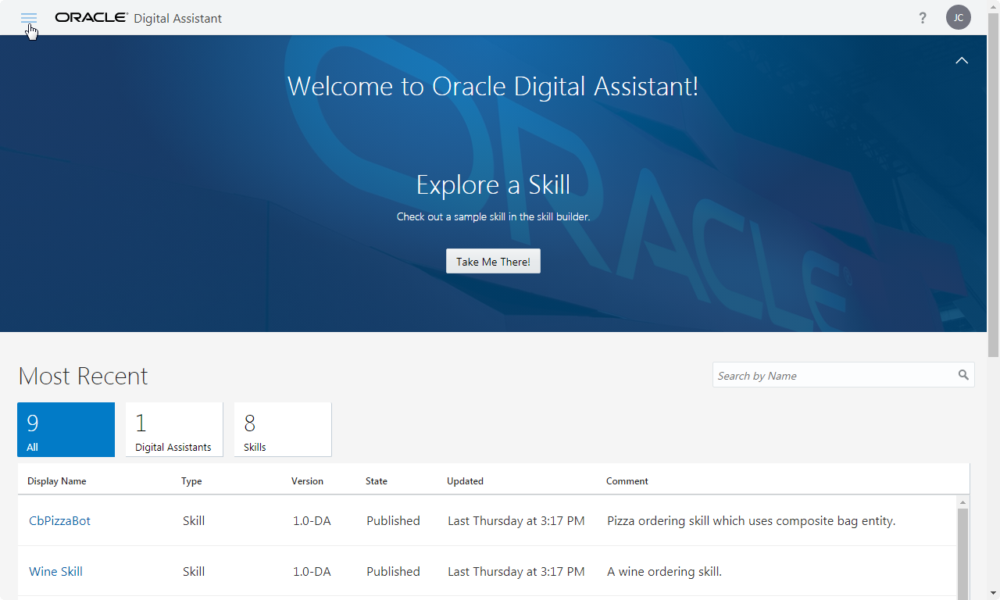

# Oracle Digital Assistant - はじめてのスキル開発

## はじめに

Oracle Digital Assistant is an environment for building digital assistants, which are user interfaces driven by artifical intelligence (AI) that help users accomplish a variety of tasks in natural language conversations.
Digital assistants consist of one or more skills, which are individual chatbots that are focused on specific types of tasks.

In this lab, you will create a skill that can be used for interactions with a pizzeria, including ordering pizzas and canceling orders.
As part of this process, you will:

* Define intents, utterances, entities.
* Design a conversation flow.
* Validate, debuga and test your skill.

### このチュートリアルの表記方法

このチュートリアルで使用している表記方法は次のとおりです。

| 表記方法 | 説明 |
|---|---|
| **「太字」** | ボタン、各種フィールドのラベルなどの GUI 要素 |
| `固定幅フォント` | サンプルコード、入力するテキスト |

## スキルの作成

このチュートリアルでは、スキルを作成する手順を一から説明していきます。
はじめに、新しくスキルを作成します。

**【ステップ 1】**
Oracle Digital Assistant の Designer UI を Web ブラウザで開きます。
画面左上の ![ハンバーガー・アイコン][icon_hamburger] をクリックしてメニューを開きます。



**【ステップ 2】**
メニューから **「Develpment」** をクリックし、 **「Skills」** を選択します。


**【ステップ 3】**
メニューを閉じるために、 ![ハンバーガー・アイコン][icon_hamburger] をもう一度クリックします。

**【ステップ 4】**
**「New Skill」** をクリックします。


**「Create Skill」** ボックスが表示されます。

**【ステップ 5】**
**「Create Skill」** ダイアログの **「Display Name」** フィールドに `Pizza King` と入力します。
このチュートリアルを同じ環境で実施する人が他にもいる場合は、区別できるように `Pizza King` の前または後ろにあなたのイニシャルなどを付けてください。
(例: `Pizza King AB`)

**【ステップ 6】**
**「Version」** フィールドに `1.0` と入力します。


**【ステップ 7】**
**「Create」** ボタンをクリックすると、Desginer UI には作成したスキルを設定するための画面が表示されます。
スキルの設定画面の左側はナビゲーション・バーになっており、![「Intents」アイコン][icon_intents_selected] が選択されています。


Here's where we'll begin to express the use case (that is, the PizzaKing-customer activity flow) in terms of the concepts that support Natural Language Processing (NLP): intents and entities.

## インテントの作成

Oracle Digital Assistant's underlying natural language processing (NLP) engine doesn't inherently know about the business or task that a skill is supposed to assist with.
For the skill to understand what it should react to, you need to define intents and examples (utterances) for how a user would request a specific intent.

For the PizzaKing example, you will create intents for ordering pizza, cancelling an order, and filing a complaint.

### インテントの作成 (1) OrderPizza

**【ステップ 1】**
Designer UI の画面左側のナビゲーションで ![「Intents」アイコン][icon_intents_selected] が選択されていることを確認します。

**【ステップ 2】**
![「+ Intent」ボタン][button_create_intent] をクリックします。

**【ステップ 3】**
**「Conversation Name」** と **「Name」** フィールドにそれぞれ `OrderPizza` と入力します。

**【ステップ 4】**
次の箇条書きで表示されている文をコピーし、イタリック体で ***「Enter your example utterances here.」*** と書かれたフィールドに貼り付けたら、キーボードの [Enter] を押します。
複数の文をまとめてコピーし、一度に貼り付けることができます。

* Would you happen to have thin crust options on your Pizzas?
* Let's order a cheese pizza
* Would love a large Pepperoni please!
* I feel like eating some pizza
* I would like to order a pizza
* Can I order a Pizza?
* What's on the menu today?
* I want pizza
* Do you server gluten-free pizza?
* I want to order pizza for lunch
* Do you have deep dish pizzas available?
* Order Pizza!

12の例文が追加され、Designer UI には次のように表示されます。


### インテントの作成 (2) CancelPizza

**【ステップ 1】**
![「+ Intent」ボタン][button_create_intent] をクリックします。

**【ステップ 2】**
**「Conversation Name」** と **「Name」** フィールドにそれぞれ `CancelPizza` と入力します。

**【ステップ 3】**
次の箇条書きで表示されている文をコピーし、イタリック体で ***「Enter your example utterances here.」*** と書かれたフィールドに貼り付けたら、キーボードの [Enter] を押します。

* Can i cancel my order?
* Cancel my order
* Cancel my Pizza please
* How do I cancel my order?
* I don't want my Pizza anymore
* I really don't want the Pizza anymore
* I'd like to cancel my order please
* Its been more than 20 mts. Please cancel my order and issue a refund to my card.
* Need to cancel my order
* Please cancel my pizza order
* Please don't deliver my Pizza

11の例文が追加され、Designer UI には次のように表示されます。


> ***Note:***
> If you are stuck, you can import the intents and utterances using [PizzaKing-Intents.csv].

### インテントのトレーニング

You've now provided the basic ingredients that allow the skill to recognize user input for ordering a pizza, but right now, the skill has no cognition.
It can't understand any user input.

To enable it to understand the intents, you need to train it.

**【ステップ 1】**
画面の右上に ![「Train」ボタン][button_train] が表示されていることを確認します。


**「Train」** ボタンにはエクスクラメーション・マークのアイコンが表示されており、トレーニングが必要なことを表しています。

**【ステップ 2】**
![「Train」ボタン][button_train] をクリックすると **「Train」** ボックスが表示されます。


**「Submit」** ボタンをクリックして数秒待つとトレーニングは完了します。
トレーニングが完了すると **「Train」** ボタンのアイコンがチェック・マークに変わります。

## モデルのテスト

It is not realistic to get the training of your intent model right the first time you do it.
Good intent models are created in an iterative cycle of training, testing, retraining, and retesting.

A good intent model is one that has a low ambiguity between the different intents.
So let's see how well we’re doing so far.

**【ステップ 1】**
Designer UI のインテントの編集ページが表示されていない場合は、画面左側のナビゲーションの ![「Intents」アイコン][icon_intents_enabled] をクリックします。

**【ステップ 2】**
画面の右上の方にある **「Try It Out!」** リンクをクリックします。


画面の右側に **「Try Out Intents/Q&A」** ボックスが表示されます。


**【ステップ 3】**
**「Try Out Intents/Q&A」** ボックスの一番下にある **「Message」** フィールドに次の文を入力します。

```
I want to order pizza
```

**「Send」** ボタンをクリックすると、**「Try Out Intents/Q&A」** ボックスは次のように表示されます。


`I want to order pizza` は、インテント OrderPizza に該当するという判定をしています。
**「Confidence」** のスコア（今回の場合は「100%」）は、NLP エンジンが結果に対する自信を数値化したものです。

**【ステップ 4】**
別の文をテストします。
次の文を **「Try Out Intents/Q&A」** ボックスの **「Message」** フィールドに入力したら、**「Send」** ボタンをクリックします。

```
I feel like eating some pizza
```

ステップ 3 で実行したテストと同様に、インテント OrderPizza と判定されます。

**【ステップ 5】**
次の文をテストします。
今回は、インテント CancelPizza と判定されます。

```
Cancel my order?
```

**【ステップ 6】**
次の文をテストします。

```
Dude, bring me pizza
```

**「Try Out Intents/Q&A」** ボックスには次のように表示されます。


上の図のとおり、NLP エンジンは `Dude, bring me pizza` （日本語訳: 「おい、ピザを持ってきて」）という文がインテント OrderPizza である可能性が最も高いと判定しています。
しかし、**「Confidence」** のスコアはそれほど高くありません。

**【ステップ 7】**
Confidence のスコアが高くない場合は、テストに使用した文をインテントの例文として追加します。
**「OrderPizza」** を選択した状態で **「Add Example」** ボタンをクリックすると、`Dude, bring me pizza` がインテント OrderPizza に例文として追加されます。


**【ステップ 8】**
インテントの例文を追加したので、トレーニングの実行が必要になりました。
画面右上の ![「Train」ボタン][button_train] をクリックしてトレーニングを実行します。

**【ステップ 9】**
**「Reset」** ボタンをクリックしてから、もう一度 `Dude, bring me pizza` という文をテストしてみます。
インテントの例文として追加されたので、インテント OrderPizza の Confidence のスコア上がっていることを確認します。

**【ステップ 10】**
テストが終わったら、![「Close」ボタン][button_close_try_it_out] をクリックして、**「Try Out Intents/Q&A」** ボックスを閉じます。

> ***Note:***
> Conversational AI does not compare input by exact matches of the words.
> Though "Dude, bring me pizza" is available as an utterance, when entering the sentence as a message, it is the intent model's algorithm that determines the matching intent.

> ***Note:***
> In these examples, you might get slightly different confidence scores than what are shown here.
> And in some cases, the matching intents themselves could vary, should the differing confidence scores push those intents above or below the given confidence thresholds.
> The cause of this variance is the non-deterministic nature of the AI behind the natural language processing and the fact that these skills have a limited number of training utterances (in order to make the lab simpler).

### このセクションのまとめ

In this part of the tutorial, you have tested the quality of your intent training with the goal being to ensure a high level of confidence when resolving intents.

In a real skill project, you would always need to go back to the intent testing with user-provided entries you find in the conversation logs.
If, using that test input, your intents are not matched the way they should be, you need to add them as example utterances to proper intents and then retrain the model.

## エンティティの作成

Now it's time to add entities, which detect information in the user input that can help the intent fulfill a user request.
For the Pizza King business, such information could be the size of pizza, the toppings of pizza, and delivery time.
For example, the user input "I'd like to order a small meaty pizza at 9:00 pm" contains all three of these information types.

We'll create custom entities for size and topping and later use a built-in entity for time.
While we're at it, we'll add some synonyms (including some common misspellings) that optimize the entity's ability to tag words from sloppy user input.

### エンティティの作成 (1) PizzaSize

**【ステップ 1】**
Designer UI の画面左側のナビゲーションで ![「Entities」アイコン][icon_entities_enabled] をクリックします。
エンティティを作成・編集するための画面が表示されます。

**【ステップ 2】**
新しいエンティティを作成するために、![「+ Entitiy」ボタン][button_create_entity] をクリックします。

**【ステップ 3】**
**「Name」** フィールドの値を `PizzaSize` に変更します。

**【ステップ 4】**
**「Configuration」** セクションのドロップダウン・リスト **「Type」** から **「Value list」** を選択します。

**【ステップ 5】**
![「+ Value」ボタン][button_create_value] をクリックします。
**「Create Value」** ボックスが表示されます。

**【ステップ 6】**
**「Value」** フィールドに `Sサイズ` と入力します。

**【ステップ 7】**
**「Synonyms」** フィールドに `Small` と入力したら、キーボードの [Tab] キーを押します。
次に `smallest` を入力してから、キーボードの [Tab] キーを押します。


**【ステップ 8】**
**「Create Value」** ボックスの **「Create」** ボタンをクリックします。

**【ステップ 9】**
ステップ5～8の操作を繰り返して、エンティティ PizzaSize に次の値を追加します。

| Value | Synonyms |
|-------|----------|
| `Mサイズ` | `Medium`, `middle` |
| `Lサイズ` | `Large`, `Big`, `biggest` |

エンティティ PizzaSize が作成されると、エンティティの編集画面には次のように表示されます。


### エンティティの作成 (2) PizzaSize

**【ステップ 1】**
新しいエンティティを作成するために、![「+ Entitiy」ボタン][button_create_entity] をクリックします。

**【ステップ 2】**
**「Name」** フィールドの値を `PizzaType` に変更します。

**【ステップ 3】**
**「Configuration」** セクションのドロップダウン・リスト **「Type」** から **「Value list」** を選択します。

**【ステップ 4】**
**「Value」** として、次の4つを追加します。

| Value | Synonyms |
|-------|----------|
| `マルゲリータ` | `Margherita` |
| `シーフード` | `sea food`, `seefood`  |
| `ポテト＆ベーコン` | `poteto and bacon`  |
| `チーズ` | `cheese` |

エンティティが作成されると、Designer UI には次のように表示されます。


### インテントとエンティティの関連付け

ユーザーが送信してきたメッセージを解析し、エンティティを抽出するためには、インテントとエンティティを関連付ける必要があります。
インテント OrderPizza と、前のセクションで作成したエンティティを関連付ける手順は次のとおりです。

**【ステップ 1】**
インテントを編集するために、Designer UI の画面左側のナビゲーションの ![「Intents」アイコン][icon_intents_enabled] をクリックします。

**【ステップ 2】**
インテントの一覧から **「OrderPizza」** を選択します。

**【ステップ 3】**
画面右側に表示される ![「+ Entity」ドロップダウン・ボタン][button_intent_entities] をクリックします。

**【ステップ 4】**
エンティティの一覧の中から **「PizzaSize」** を選択します。


**【ステップ 5】**
ステップ3～4の操作を繰り返して、次の２つのエンティティを追加します。

* PizzaType
* TIME

エンティティ TIME は、Oracle Digital Assistant が提供するビルトインのエンティティのひとつです。
今回は、ピザの配達時間を指定するために使用します。

ここまでの操作によって、インテント OrderPizza に関連付けられたエンティティは次のように表示されます。
（実際の画面と表示される順番が異なることがありますが、特に問題はありません）


**【ステップ 6】**
インテントにエンティティが関連付けられたので、トレーニングが必要になります。
画面右上の ![「Train」ボタン][button_train] をクリックしてトレーニングを実行します。

### エンティティのテスト

インテントのテストに使用した **「Try It Out」** ボックスを使用して、ユーザーが送信したメッセージからエンティティの値を抽出できることを確認しましょう。

**【ステップ 1】**
Designer UI の画面左側のナビゲーションで ![「Intents」アイコン][icon_intents_selected] を選択します。

**【ステップ 2】**
**「Try It Out!」** をクリックして、**「Try Out Intents/Q&A」** ボックスを開きます。

**【ステップ 3】**
**「Try Out Intents/Q&A」** ボックスの **「Message」** フィールドに、次の文を入力します。

```
I want to order a small cheese pizza at 7:30 pm
```

**「Send」** ボタンをクリックすると、入力された文から３つのエンティティ（PizzaSize、PizzaType、TIME）の値が抽出されます。
**「Try Out Intents/Q&A」** ボックスには次のように表示されます。


> ***Note:***
> You may need to scroll up in the dialog to see the entities.

**【ステップ 4】**
他の例についても試してみましょう。
**「Try Out Intents/Q&A」** ボックスの **「Message」** フィールドに次の文を入力し、**「Send」** ボタンをクリックします。

```
I want to order the biggest margherita pizza at noon
```

The result should look like what is shown below and thus prove that the PizzaSize entity shows the right value for the biggest synonym.
Also "noon" is properly interpreted as 12:00 p.m.


### このセクションのまとめ

このセクションでは、ピザの注文プロセスを実行する上で必要な情報をカスタム・エンティティとして定義し、インテント OrderPizza と関連付けました。
また、ユーザーが送信されたメッセージからエンティティの情報を抽出するテストの手順についても確認しました。

## ダイアログ・フローのデザイン

With the NLP model created, you are ready to build the dialog flow for the skill.
The dialog flow is a conversation blueprint that defines interactions users may have with the skill.
Each interaction is defined as a state. Each state references a component, which renders a skill response, receives user input, sets and resets variables, resolves user intents, or authenticates users.

### ダイアログ・フローのアウトラインのセットアップ

Our first step is to create the basic flow outline, including context variables and states to handle the user's initial input.

Context variables are the skill's temporary memory.
They can be referenced throughout the dialog flow.
We'll add context variables to hold values returned by the intent engine, entity values, and the value for the pizza order message.

**【ステップ 1】**
Designer UI のナビゲーションで ![「Flows」アイコン][icon_flows_enabled] をクリックし、ダイアログ・フロー・エディタを開きます。

**【ステップ 2】**
`variables:` と `states:` の間の行を削除します。<!-- TODO: 具体的な行番号を書く -->

**【ステップ 3】**
`states:` より下の行を削除します。

ダイアログ・フロー・エディタは次は次のように表示されます。


**【ステップ 4】**
`variables:` の行の下に次の5行を追加します。

```yaml
    iResult: "nlpresult"
    pizzaSize: "PizzaSize"
    pizzaType: "PizzaType"
    deliveryTime: "TIME"
    pizzaOrderMsg: "string"
```

> ***Note:***
> 追加した5行は `variables:` の行よりも半角スペース2個分多くインデントされている必要があります（合計するとスペース4個分）。
> YAML ベースの OBotML では、インデントを使って階層構造を表現するため、正しくインデントされていないと構文エラーになります。

ここまでの編集によって、ダイアログ・フロー・エディタは次のように表示されます。


これで、ダイアログ・フローにステートを追加する準備が整いました。

### インテントを判定するステートの追加

このハンズオンでは最初に、ダイアログ・フローに `System.Intent` コンポーネントを追加します。
この `System.Intent` コンポーネントは、ユーザーが送信してきた文を評価して、スキルに定義されているインテントを判定します。
インテントにエンティティが含まれている場合はエンティティをすべて抽出してから、後続のステートに処理を遷移させます。

**【ステップ 1】**
![「Components」ボタン][button_components] をクリックして、コンポーネントのテンプレート・ギャラリを開きます。

**【ステップ 2】**
コンポーネントのテンプレート・ギャラリでは最初にコンポーネントのタイプを選択します。
**「Language」** を選択します。


**【ステップ 3】**
コンポーネントのテンプレート・ギャラリの左側にコンポーネントのリストが表示されます。
コンポーネントのリストから **「Intent」** を選択し、**「Remove Comments」** のスイッチをオンにします。


**【ステップ 4】**
コンポーネントのテンプレート・ギャラリの **「Apply」** ボタンをクリックします。

**【ステップ 5】**
`System.Intent` コンポーネントのテンプレートが追加されました。
`System.Intent` コンポーネントの `variable` プロパティの値として `"iResult"` を設定します（ダブル・クォーテーション `"` が必要です）。

```yaml
      variable: "iResult"
```

これによって NLP エンジンによるインテントの判定とエンティティの抽出結果が、変数 `iResult` に保存されます。

**【ステップ 6】**
テンプレートによって追加された次のプロパティは削除します。

* botName
* botVersion
* sourceVariable
* autoNumberPostbackActions
* footerText

**【ステップ 7】**
次に遷移するステートを設定するため、`transition.actions` プロパティを次のように編集します。

```yaml
    transitions:
      actions:
        OrderPizza: "startOrderPizza"
        CancelPizza: "cancelPizza"
        unresolvedIntent: "startUnresolved"
```

これにより、インテントの判定結果に応じて次のステートに遷移します。

| インテント | 遷移先のステート |
|---|---|
| OrderPizza | startOrderPizza |
| CancelPizza | startCancelPizza |
| 該当するインテントがないと判定された場合 (unresolvedIntent) | startUnresolved |

### 各インテントの処理を開始するステートの追加

次に、NLP エンジンが判定したインテントに対応した遷移先となる、３つのステートをダイアログ・フローに追加します。

* startOrderPizza
* startCancelPizza
* startUnresolved

それぞれのステートは、`System.Output` コンポーネントを使用してメッセージを出力した後、`transitions.return` プロパティを使用して会話を終了します。
このチュートリアルでは時間を節約するために、テキストをコピーし、ダイアログ・フロー・エディタに貼り付けることにします。

**【ステップ 1】**
[states.txt] を開きます。

**【ステップ 2】**
テキストのコンテンツをコピーし、ダイアログ・フローの最後に貼り付けます。

貼り付けられたコンテンツが、インデントを保持していることを確認してください。

**【ステップ 3】**
Designer UI の右上にある **「Validate」** ボタンをクリックして、追加したステートの構文が正しいことを確認します。

<!--
```yaml
  # Intent が OrderPizza の場合: ピザの注文
  startOrderPizza:
    component: "System.Output"
    properties:
      text: "こんにちは、Pizza King です。ご注文を承ります。"
      keepTurn: false
    transitions:
      return: "done"

  # Intent が CancelPizza の場合: ピザの注文をキャンセル
  startCancelPizza:
    component: "System.Output"
    properties:
      text: "注文のキャンセルを承りました。"
    transitions:
      return : "done"

  # 該当するインテントがないと判定された場合
  startUnresolved:
    component: "System.Output"
    properties:
      text: "申し訳ありません。おっしゃっていることが理解できませんでした。"
    transitions:
      return: "done"
```
-->

### ダイアログ・フローのトラブルシューティング

If you don't see a success message, then most likely you misspelled a property name or did not follow the required two-space indenting increments.
In this case, scroll through the dialog flow until you see an [x error] icon icon in the left margin.
Mouse over the icon to display the tooltip with a description of the problem.

In addition, you can click the debug icon ([debug icon]), which appears to the left of the dialog flow editor.
It often provides additional information about the reason.
You close the debug window by clicking the debug icon again.

If you have gotten into a jam and can’t get anything to work, open the [your-first-dialog-flow.txt] and replace the content in your dialog flow with the content from the file.

### インテントの判定のチューニング

Before moving further, let's take a look at some settings that are useful for fine-tuning intent resolution.

* **Confidence Threshold**:
The skill uses this property to steer the conversation by the confidence level of the resolved intent.
Set the minimum confidence level required to match an intent.
When the level falls below this minimum value, the component triggers its unresolvedIntent action.

* **Confidence Win Margin**:
When a skill can’t determine a specific intent, it displays a list of possible intents and prompts the user to choose one.
This property helps the skill determine what intents should be in the list.
Set the maximum level to use for the delta between the respective confidence levels for the top intents.
The list includes the intents that are greater than or equal to this delta and exceed the value set for the Confidence Threshold.

Let's update these settings:

**【ステップ 1】**
Designer UI の画面左側のナビゲーションで ![「Settings」アイコン][icon_settings_enabled] をクリックします。
次に、画面上部にある **「Configuration」** タブを選択します。

**【ステップ 2】**
**「Confidence Threshold」** の値を `0.6` (60% 以上を意味しています) に設定します。

**【ステップ 3】**
**「Confidence Win Margin」** の値を `0.1` (10% 以上を意味しています)に設定します。


### ダイアログ・フローのテスト

スキルの開発を進める前に、ここまでに設定した内容をテストしてみましょう。
Designer UI の Skill Tester を使用すると、簡単に会話の流れを確認できます。
ここでは、各インテントに応じたメッセージが表示されることを確認します。

**【ステップ 1】**
Designer UI の画面左側のナビゲーション・バーの下部にある ![「Skill Tester」アイコン][icon_skill_tester] をクリックします。
（ディスプレイのサイズによっては、下にスクロールする必要があります）

**【ステップ 2】**
Skill Tester の左下にある **「Message」** フィールドに次の文を入力してから、キーボードの [Enter] キーを押します。

```
I want to order a pizza
```

OrderPizza に対応した（ステート `startOrderPizza` で設定した）メッセージが表示されることを確認します。

**【ステップ 3】**
Skill Tester の右側にある **「Intent/Q&A」** タブをクリックすると、NLP エンジンによるインテントの判定結果を確認できます。
次のスクリーンショットのように表示されているはずです。


**【ステップ 4】**
Skill Tester の右上にある **「Reset」** ボタンをクリックします。
表示されていた内容がクリアされ、会話がリセットされます。

**【ステップ 5】**
Skill Tester の **「Message」** フィールドに次の文を入力してから、キーボードの [Enter] キーを押します。

```
I want to cancel my order
```

CancelPizza に対応した（ステート `startCancelPizza` で設定した）メッセージが表示されることを確認します。

**【ステップ 6】**
Skill Tester の **「Reset」** ボタンをクリックします。

**【ステップ 7】**
今回作成したインテント（ピザの注文やキャンセル）とは関係のない文も試してみましょう。
Skill Tester の **「Message」** フィールドに次の文を入力してから、キーボードの [Enter] キーを押します。

```
Can you get me a radio taxi now?
```

**【ステップ 8】**
**「Intent/Q&A」** タブをクリックして NLP エンジンの判定結果を確認します。


作成した2つのインテントのどちらも Confidence スコアが 60% を超えていません。
そのため、該当するインテントがないと判定された場合 (unresolvedIntent) に対応したステート `startUnresolved` に遷移しました。

### ピザの注文を受ける会話の作成

Now that we have verified that the basic intent model is working, the next step is to implement conversation flows for each intent.
In the interest of time, we'll do this just for the PizzaOrder intent.

We'll complete the pizza order process by fetching the pizza size, topping, and delivery time, and then printing an order summary.

1. `setPizzaSize`: ピザのサイズを選択
2. `setPizzaType`: ピザの種類を選択
3. `setPizzaDeliveryTime`: ピザの配達時間を指定
4. `setPizzaOrderMessage`: 注文内容の確認メッセージの生成
5. `showPizzaOrder`: 注文内容の確認メッセージの出力

**【ステップ 1】**
前のセクションで追加したダイアログ・フロー・エディタの `startOrderPizza` ステートにナビゲートします。

**【ステップ 2】**
`keepTurn` プロパティの値を `true` に変更します。
通常は、スキルとユーザーが交互にメッセージを送信しますが、`keepTurn` プロパティの値を `true` に設定すると、スキルからユーザーに連続でメッセージを送信できます。
ブーリアン型の値 (`true` または `false` のどちらかをセットする値)は、ダブル・クォーテーション (`"`) は不要です。

**【ステップ 3】**
`transitions:` の次の行にある `return: "done"` を `next: "setPizzaSize"` に置き換えます。

```yaml
  startOrderPizza:
    component: "System.Output"
    properties:
      text: "こんにちは、Pizza King です。ご注文を承ります。"
      keepTurn: true
    transitions:
      next: "setPizzaSize"
```

#### ピザのサイズの選択

**【ステップ 1】**
![「Components」ボタン][button_components] をクリックして、コンポーネントのテンプレート・ギャラリを開きます。

**【ステップ 2】**
コンポーネントのタイプとして **「User Interface」** を選択します。

**【ステップ 3】**
コンポーネントのリストから **「List - set variable」** を選択します。

**【ステップ 4】**
ドロップダウン **「Insert After」** から **「startOrderPizza」** を選択します。

**【ステップ 5】**
**「Remove Comments」** スイッチをオンにします。


**【ステップ 6】**
**「Apply」** ボタンをクリックします。
追加済みのステート `startOrderPizza` の次に `System.List` のテンプレートが追加されます。

**【ステップ 7】**
追加されたステートの名前を `variableList` から `setPizzaSize` に変更します。

**【ステップ 8】**
テンプレートで追加されたステートを次のように編集します。

```yaml
  setPizzaSize:
    component: "System.List"
    properties:
      options: "${pizzaSize.type.enumValues}"
      prompt: "ピザのサイズはどれにしますか？"
      variable: "pizzaSize"
      nlpResultVariable: "iResult"
    transitions:
      next: "setPizzaType"
```

#### ピザの種類の選択

次のコード･ブロックをコピーし、ステート `setPizzaSize` の後に貼り付けます。

```yaml
  setPizzaType:
    component: "System.List"
    properties:
      options: "${pizzaType.type.enumValues}"
      prompt: "どのピザにしますか？"
      variable: "pizzaType"
      nlpResultVariable: "iResult"
    transitions:
      next: "setPizzaDeliveryTime"
```

追加されたステート `setPiizaType` は、`setPizzaSize` と同様に `System.List` コンポーネントを使用しています。
表示されるオプションは、エンティティ `PizzaType` の値が使用されます。

#### ピザの配達時間の指定

**【ステップ 1】**
![「Components」ボタン][button_components] をクリックして、コンポーネントのテンプレート・ギャラリを開きます。

**【ステップ 2】**
コンポーネントのタイプとして **「User Interface」** を選択します。

**【ステップ 3】**
コンポーネントのリストから **「Text」** を選択します。

**【ステップ 4】**
ドロップダウン **「Insert After」** から **「setPizzaType」** を選択します。

**【ステップ 5】**
**「Remove Comments」** スイッチをオンにします。

**【ステップ 6】**
**「Apply」** ボタンをクリックします。
ステート `setPizzaType` の次に `System.Text` コンポーネントのテンプレートが追加されます。

**【ステップ 7】**
追加されたステートの名前を `text` から `setPizzaDeliveryTime` に変更します。

**【ステップ 8】**
テンプレートで追加されたステートを次のように編集します。

```yaml
  setPizzaDeliveryTime:
    component: "System.Text"
    properties:
      prompt: "何時にお届けしますか？"
      variable: "deliveryTime"
      nlpResultVariable: "iResult"
      maxPrompts: 3
    transitions:
      actions:
        cancel: "maxError"
        next: "setPizzaOrderMessage"
```

**【ステップ 9】**
ユーザーから送信されたテキストを時刻として解釈できなかった場合は、`maxPrompts` で設定した回数（今回は `3`）ユーザーに入力を促します。
最終的に時刻として解釈できなかった場合は、`transitions.actions.cancel` で指定したステートに遷移します。
次のステートのコードをコピーし、ダイアログ・フローの最後に貼り付けます。

```yaml
  maxError:
    component: "System.Output"
    properties:
      text: "恐れ入りますがお電話でのご注文をお願いします。"
    transitions:
      return: "done"
```

#### 注文内容の確認メッセージの生成

**【ステップ 1】**
![「Components」ボタン][button_components] をクリックして、コンポーネントのテンプレート・ギャラリを開きます。

**【ステップ 2】**
コンポーネントのタイプとして **「Variables」** を選択します。

**【ステップ 3】**
コンポーネントのリストから **「Set variable」** を選択します。

**【ステップ 4】**
ドロップダウン **「Insert After」** から **「setPizzaDeliveryTime」** を選択します。

**【ステップ 5】**
**「Remove Comments」** スイッチをオンにします。

**【ステップ 6】**
**「Apply」** ボタンをクリックします。
ステート `setPizzaDeliveryTime` の次に `System.SetVariable` のテンプレートが追加されます。

**【ステップ 7】**
追加されたステートの名前を `text` から `setPizzaDeliveryTime` に変更します。

**【ステップ 8】**
テンプレートで追加されたステートを次のように編集します。

```yaml
  setPizzaOrderMessage:
    component: "System.SetVariable"
    properties:
      variable: "pizzaOrderMsg"
      value:
      - "ご注文ありがとうございます。次のとおりご注文を承りました。"
      - "サイズ: ${pizzaSize.value}"
      - "種類: ${pizzaSize.value}"
      - "配達時刻: ${deliveryTime.value.date?long?number_to_time?string('HH:mm')}"
```

> ***Note:***
> The `text` property value uses the Apache FreeMarker expression |- to print multi-line text in a single response bubble.
> Alternatively, you could have used multiple output text components.

#### 注文内容の確認メッセージの出力

**【ステップ 1】**
![「Components」ボタン][button_components] をクリックして、コンポーネントのテンプレート・ギャラリを開きます。

**【ステップ 2】**
コンポーネントのタイプとして **「User Interface」** を選択します。

**【ステップ 3】**
コンポーネントのリストから **「Output」** を選択します。

**【ステップ 4】**
ドロップダウン **「Insert After」** から **「setPizzaOrderMessage」** を選択します。

**【ステップ 5】**
**「Remove Comments」** スイッチをオンにします。

**【ステップ 6】**
**「Apply」** ボタンをクリックします。
ステート `setPizzaOrderMessage` の次に `System.Output` のテンプレートが追加されます。

**【ステップ 7】**
追加されたステートの名前を `output` から `showPizzaOrder` に変更します。

**【ステップ 8】**
テンプレートで追加されたステートを次のように編集します。

```yaml
  showPizzaOrder:
    component: "System.Output"
    properties:
      text: |-
             <#list pizzaOrderMsg.value as text>${text}

             </#list>
    transitions:
      return: "done"
```

### ダイアログ・フローの検証

ダイアログ・フローの構文が正しいかどうかを確認するために、画面の右上にある **「Validate」** ボタンをクリックします。
エラーが表示された場合は、修正してください。

エラーを修正できない場合は、[complete-dialog-flow.txt] を開いて内容をコピーし、ダイアログ・フロー・エディタに貼り付けてみてください。

## スキルのテスト

Now that all of the skill's pieces are in place, let's test its behavior.

**【ステップ 1】**
Designer UI の画面左側のナビゲーション・バーの下部にある ![「Skill Tester」アイコン][icon_skill_tester] をクリックします。

**【ステップ 2】**
Skill Tester に以前に実行したテスト結果が表示されている場合は、**「リセット」** ボタンをクリックします。

**【ステップ 3】**
Skill Tester の **「Message」** フィールドに次の文を入力したら、キーボードの [Enter] キーを押します。

```
I want to order pizza
```

ピザのサイズの選択を促すメニューが表示されます。


**【ステップ 4】**
ピザのサイズを選択するメニューから適当に値を選択します。

**【ステップ 5】**
ピザの種類を選択するメニューが表示されます。
適当な種類を選択します。

**【ステップ 6】**
配達時刻の入力を促されます。`7:30 PM` や `19:30` のように時刻を指定します。

これにより、注文内容の確認メッセージが表示されます。


**【ステップ 7】**
Skill Tester の **「Reset」** ボタンをクリックします。

**【ステップ 8】**
Skill Tester の **「Message」** フィールドに次の文を入力したら、キーボードの [Enter] キーを押します。

```
can you get me the biggest seafood pizza you can make at noon
```

今回は、ユーザーが送信した文にエンティティの情報が含まれているので、すぐに注文内容の確認メッセージが表示されます。


**【ステップ 9】**
Skill Tester の **「Conversation」** タブを下にスクロールすると、エンティティの値が抽出されていることがわかります。


Congratulations!
You have created your first skill and learned key aspects of defining intents, defining entities, designing the conversation flow, and using the tester to evaluate intent resolution and the conversation flow.

<!--- Designer UI のアイコン/ボタンのスクリーンショットへのリファレンス -->
[icon_hamburger]:           images/icon_hamburger.png           "ハンバーガー・アイコン"
[icon_debug]:               images/icon_debug.png               "デバッグ・アイコン"
[icon_entities_enabled]:    images/icon_entities_enabled.png    "「Entities」アイコン"
[icon_entities_selected]:   images/icon_entities_selected.png   "「Entities」アイコン"
[icon_error]:               images/icon_error.png               "エラー・アイコン"
[icon_flows_enabled]:       images/icon_flows_enabled.png       "「Flows」アイコン"
[icon_flows_selected]:      images/icon_flows_selected.png      "「Flows」アイコン"
[icon_intents_enabled]:     images/icon_intents_enabled.png     "「Intents」アイコン"
[icon_intents_selected]:    images/icon_intents_selected.png    "「Intents」アイコン"
[icon_settings_enabled]:    images/icon_settings_enabled.png    "「Settings」アイコン"
[icon_settings_selected]:   images/icon_settings_selected.png   "「Settings」アイコン"
[icon_skill_tester]:        images/icon_skill_tester.png        "「Skill Tester」アイコン"
[button_close_try_it_out]:  images/button_close_try_it_out.png  "「Close」ボタン"
[button_components]:        images/button_components.png        "「Components」ボタン"
[button_create_entity]:     images/button_create_entity.png     "「+ Entity」ボタン"
[button_create_intent]:     images/button_create_intent.png     "「+ Intent」ボタン"
[button_create_value]:      images/button_create_value.png      "「+ Value」ボタン"
[button_intent_entities]:   images/button_intent_entities.png   "「+ Entity」ドロップダウン・ボタン"
[button_train]:             images/button_train.png             "「Train」ボタン"
